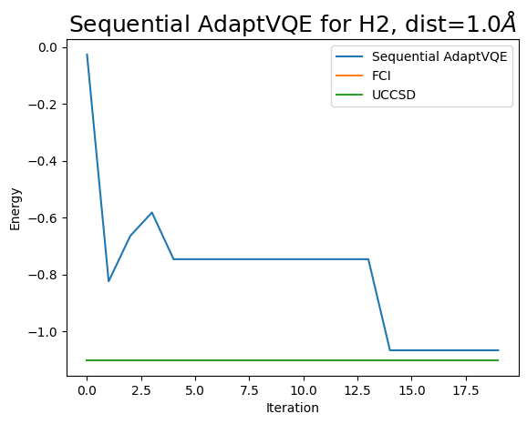

# Sequential-ADAPT-VQE

Sequential-ADAPT VQE

本项目是实现SAV算法的介绍文档

目前存在的逻辑问题：

* **参考态的定义**？如果没有合理的起始参考态 起始第一轮都没有梯度 非常随机，*既然都随机了，为何还要计算准备添加哪个门呢？*
* **物理意义**？三种ansatz设计方法 各有各的motivation：HEA追求高效、通用，不纠结于如何构造，改L就行；化学启发式追求对多体物理过程的数学表达式的近似，是有物理意义可解释性的。此算法意义何在？本质就是HEA大类下的，但还纠结于构造Ansatz,感觉是吸取了ADAPT和HEA两大方法的糟粕于一身(无物理意义、测量开销大)。
* **优越性在哪**？模拟起来更高效吗？精度更高吗？消耗更少吗？关键实验论证下，H4分子的模拟结果与EHA、HEA、UCCSD、ADAPT VQE比较，看是否有优势，只要比UCCSD强都行.. 但从结果看相同规模开销下,H2的模拟结果不如UCCSD
* **算法细节**？，之前ADAPT那么收追捧就是因为其找到了一种低成本的ansatz增长策略(选算子时无参数量优化过程)，而此算法选算子时没使用梯度，直接执行VQE子程序，看哪个更好，这是最大硬伤，*人家的算法是在合理地猜哪种ansatz更好，猜得好也有数学依据，你这是在暴力穷举。*

改进建议：

* 尝试不同参考态作为起始态，观察效果
* 算子的选择为何要三种旋转门？理由是？
* 实验论证这算法真的有价值，模拟H2、H4比UCCSD、HEA、EHA、ADAPT强
* 解决增长策略问题，目前没有增长策略是在穷举

总结：

运行详情[点击查看log](./Sequential_AdaptVQE2024-04-03-21-30-57Sequential_AdaptVQE2024-04-03-08-13-0)
